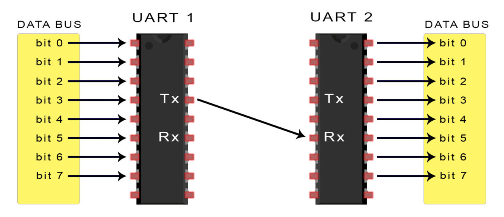
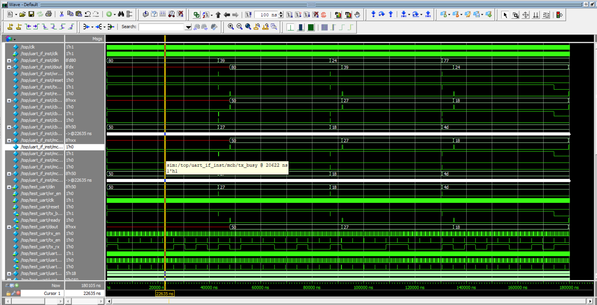

# UART Verification Environment

Verification of UART Model Using in SystemVerilog and UVM. \
\

* [System Verification Environment](UART_SV)
* [Universal Verification Methodology (UVM)](UART_UVM)

## Wave Signals

#
All the Above Programmes are implemented in [EDAPlayground](https://www.edaplayground.com/home)